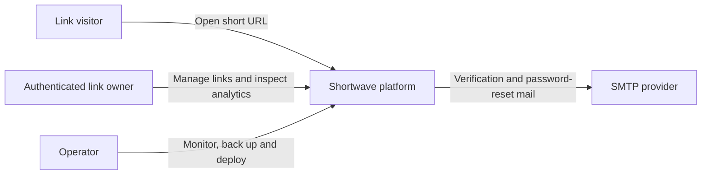
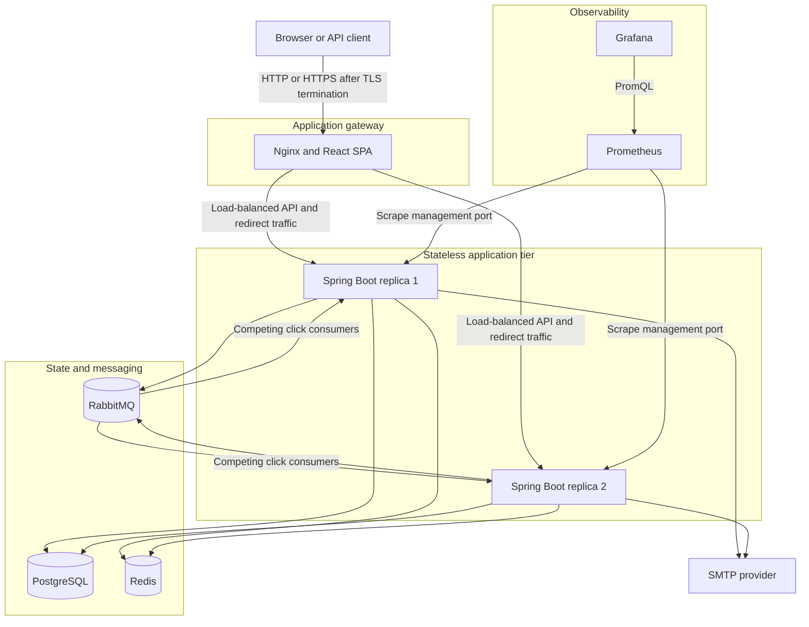
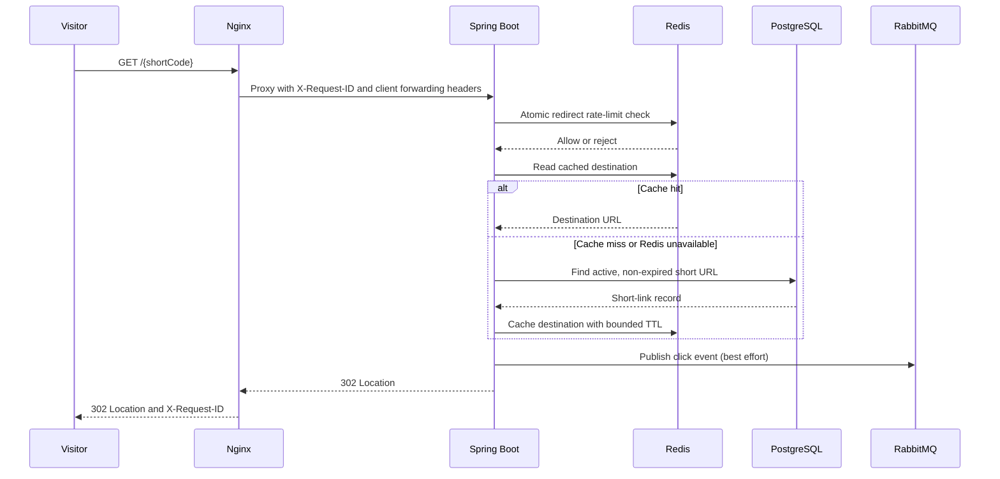
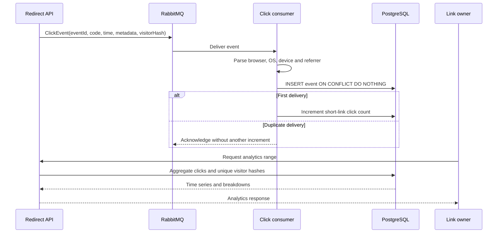
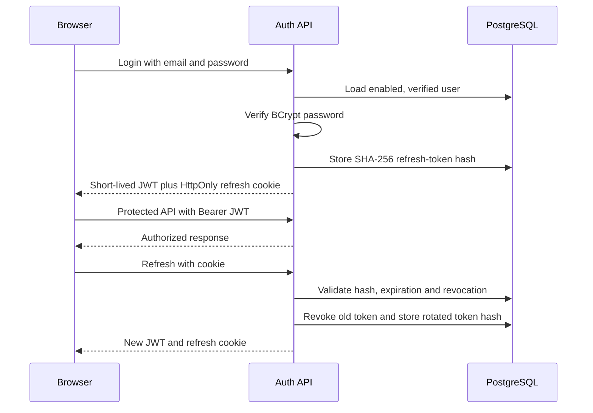
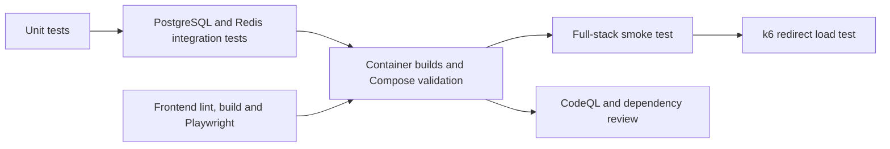

# System architecture

## Purpose

Shortwave is a distributed URL-shortening and analytics platform. It prioritizes a fast redirect path, keeps management data durable in PostgreSQL, moves click processing off the visitor request through RabbitMQ and exposes operational signals through Prometheus and Grafana.

This document describes the architecture implemented in the repository. The production Compose topology is suitable for a single Docker host; the limitations section distinguishes that deployment from a globally distributed service.

## System context

## Runtime topology

Nginx is the only public container in the production Compose model. PostgreSQL, Redis and RabbitMQ remain on the private Compose network. Prometheus and Grafana bind to loopback for access through an authenticated tunnel or private network.

## Component responsibilities

| Component | Responsibility | State model |
| --- | --- | --- |
| React SPA | Authentication, link management, filters, bulk actions and analytics views | Browser session storage holds only the short-lived access token |
| Nginx | Static frontend, API proxy, backend load balancing and request-ID generation | Stateless |
| Spring Boot | Authentication, authorization, link lifecycle, redirect resolution, analytics and scheduled retention | Stateless application replicas |
| PostgreSQL | Users, short links, token hashes, click events, audit history and counters | Durable source of truth |
| Redis | Redirect cache and distributed fixed-window rate-limit counters | Rebuildable/ephemeral acceleration state |
| RabbitMQ | Buffer between redirect responses and click persistence | Durable queue with retry and dead-letter routing |
| Prometheus | Scrape and retain operational metrics | Time-series volume |
| Grafana | Provisioned operational dashboard | Dashboard configuration plus local Grafana volume |
| SMTP provider | Deliver verification and password-reset messages | External service |

## Redirect path

PostgreSQL remains authoritative. Redis failures do not make an existing link disappear because cache reads fall back to PostgreSQL. Link updates, status changes and deletion evict the related cache key; failed eviction is bounded by the cache TTL.

Click publication deliberately does not block redirect completion. A broker or serialization failure is logged and the visitor still receives the destination, trading perfect analytics completeness for redirect availability.

## Click analytics path

The queue provides asynchronous, at-least-once delivery. The UUID `event_id` primary key makes persistence idempotent, so a redelivery cannot increment the counter twice. Malformed messages are rejected without requeue and broker configuration routes rejected messages to the dead-letter queue.

## Authentication and session model

Access tokens are short-lived JWTs. Refresh tokens, password-reset tokens and email-verification tokens are random values whose raw form is delivered only to the client; PostgreSQL stores their SHA-256 hashes. Refresh tokens rotate on use, can be revoked per device and are all revoked after password reset or password change.

## Data ownership

| Data | Primary owner | Derived or cached copies |
| --- | --- | --- |
| User identity and profile | PostgreSQL `users` | JWT claims for the access-token lifetime |
| Short-link destination and lifecycle | PostgreSQL `short_urls` | Redis destination cache |
| Click detail | PostgreSQL `click_events` | RabbitMQ while awaiting persistence |
| Aggregate click counter | PostgreSQL `short_urls.click_count` | Analytics API responses |
| Link audit history | PostgreSQL `short_url_audit_events` | None |
| Refresh sessions | PostgreSQL `refresh_tokens` | Raw token only in HttpOnly cookie |
| Reset and verification challenges | PostgreSQL token tables | Raw token only in email link |
| Rate-limit usage | Redis | None; expires with the configured window |
| Metrics | Prometheus | Grafana queries and visualizations |

Flyway owns schema evolution. JPA runs with `ddl-auto=validate`, so application startup fails when entity mappings and the migrated schema disagree.

## Consistency and failure behavior

| Condition | Behavior |
| --- | --- |
| Redis redirect-cache outage | Read from PostgreSQL; cache writes/evictions log warnings |
| Redis rate-limit outage | Local/dev can fail open; production override fails closed |
| RabbitMQ publish failure | Redirect succeeds; the affected click may be missing from analytics |
| Duplicate RabbitMQ delivery | Idempotent insert prevents duplicate click persistence/counting |
| PostgreSQL outage | Management and cache-miss redirects fail; cached redirects may still resolve until TTL, subject to rate-limit behavior |
| Disabled, blocked or expired link | Redirect API returns HTTP 410 |
| Unknown short code | Redirect API returns HTTP 404 |
| Invalid/expired access token | Protected API returns HTTP 401; frontend attempts one refresh flow |

## Security boundaries

- TLS terminates at an external reverse proxy or cloud load balancer in the production model.
- Nginx is the public gateway; management metrics and data services are not publicly published.
- Spring Security treats authentication and redirect endpoints as public and requires JWT authentication for management APIs.
- Production refresh cookies are `HttpOnly`, `Secure` and rotated on refresh.
- Passwords use BCrypt; reset, verification and refresh token tables store hashes rather than bearer secrets.
- Visitor uniqueness and anonymous rate-limit identity use a keyed fingerprint instead of storing raw IP addresses.
- Redis uses an atomic Lua increment/expiry operation so all backend replicas share one rate-limit decision.
- `X-Request-ID` is generated or validated at the request boundary, returned to clients and placed in backend log MDC.
- CodeQL, dependency review, npm audit and Dependabot protect the repository supply chain; release images receive signed provenance attestations.

## Scaling model

The application tier is horizontally scalable because authentication state, rate limits, cache entries and durable records live outside each Spring Boot process. RabbitMQ distributes click work among competing consumers. Nginx reaches Compose backend replicas through Docker DNS.

The current deployment intentionally stops short of global distribution:

- PostgreSQL, Redis and RabbitMQ are single-instance services in Compose.
- Nginx and the Docker host are a single failure domain.
- There is no cross-region replication, global CDN or edge redirect cache.
- Database failover and point-in-time recovery are operator-managed.
- RabbitMQ publication is best effort, so analytics favors redirect availability over lossless capture.
- Compose scaling is appropriate for demonstration and a single-host deployment, not automatic multi-host orchestration.

A future multi-region design would require managed replicated data services, globally unique code allocation, explicit cache-invalidation strategy, durable event publication (for example an outbox) and traffic routing at the edge.

## Observability and operations

- Every application response carries `X-Request-ID`; Nginx access logs and Spring logs share the identifier.
- Spring Boot Actuator exports JVM, HTTP, HikariCP, process and custom redirect metrics on the private management port.
- Prometheus discovers both backend replicas and Grafana provisions the datasource and dashboard automatically.
- Scheduled jobs disable expired links and purge old refresh tokens, reset tokens, abandoned registrations, click events and audit events according to configured retention policies.
- PowerShell tooling covers PostgreSQL backup/restore and end-to-end stack smoke testing.
- k6 exercises the redirect path without following and loading the external destination.
- CI verifies backend tests, frontend lint/build/E2E, container builds, Compose invariants, smoke behavior and security analysis.

## Repository map

| Path | Contents |
| --- | --- |
| `src/main/java/.../auth` | Login, refresh sessions, email verification and password reset |
| `src/main/java/.../shorturl` | Link lifecycle, redirect resolution, cache and audit history |
| `src/main/java/.../click` | Event publication, consumption, retention and analytics |
| `src/main/java/.../ratelimit` | Distributed Redis rate limiting |
| `frontend/src` | React landing page, authentication and dashboard |
| `monitoring` | Prometheus and provisioned Grafana configuration |
| `load-testing` | Dockerized k6 redirect test |
| `ops` | Backup, restore, smoke-test and production runbooks |
| `.github/workflows` | CI, security analysis and container publication |

## Verification layers

